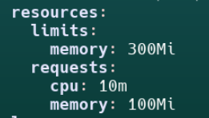
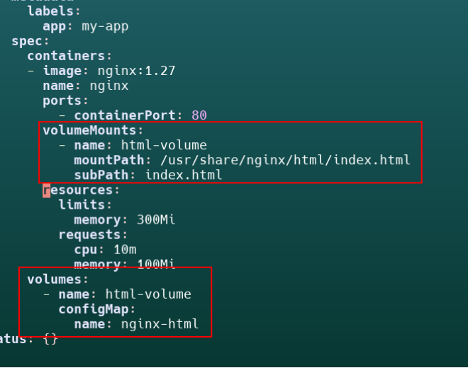
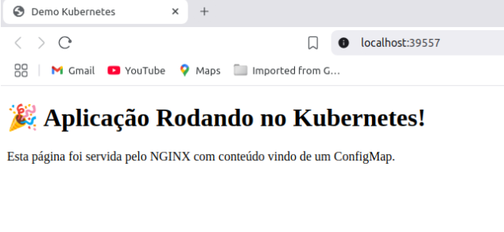
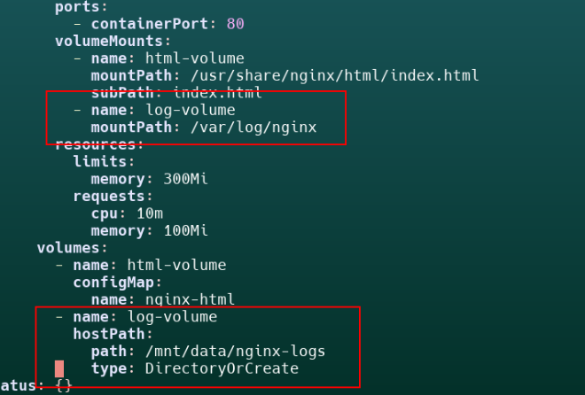
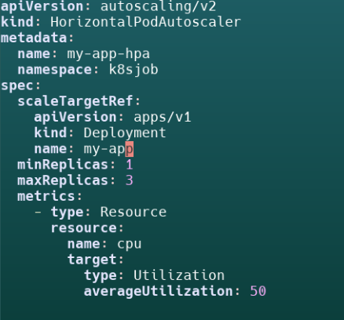
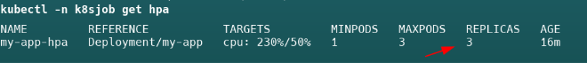

##### Criação do namespace do projeto:
	kubectl create ns k8sjob

##### Criação do Manifesto de Deploy:

    kubectl create deployment my-app --image nginx:1.27 –namespace k8sjob --dry-run=client -o yaml > deployment.yaml

##### Adicionando limits e requests de cpu e memória no deployment:

	

##### Criando configmap com a página estática e mapeando como volume no deployment:

    kubectl -n k8sjob create configmap nginx-html --from-file=index.html

##### Criando volume do tipo hostPath e mapeando o volume para armazenar os logs do nginx:

##### Aplicando o deployment:

    kubectl apply -f deployment.yaml

##### Criando o service:

    kubectl -n k8sjob expose deployment my-app

##### Aplicando o metrics server no cluster para disponibilizar as métricas de cpu e memória para  o Horizontal Pod Auto Scaler:

    kubectl apply -f https://github.com/kubernetes-sigs/metrics-server/releases/latest/download/components.yaml

##### Ajuste do metrics server para funcionar no cluster do tipo kind:

    kubectl -n kube-system patch deployment metrics-server \
 	 --type=json -p='[{"op": "add", "path": "/spec/template/spec/containers/0/args/-", \
     "value": "--kubelet-insecure-tls"}]'
    
    kubectl -n kube-system patch deployment metrics-server \
 	 --type=json -p='[{"op": "add", "path": "/spec/template/spec/containers/0/args/-", / 
     "value": "--kubelet-preferred-address-types=InternalIP"}]'

##### Aplicando o Horizontal Pod Auto Scaler:

 
    kubectl apply -f hpa.yaml

##### Criação de um pod para testar o auto scaling da aplicação:

    kubectl run -i --tty load-generator --image=busybox --restart=Never -- sh

##### Rodando Script de carga para aumentar o consumo de cpu e ativar o auto scaling:

    while true; do wget -q -O- http://my-app.k8sjob.svc.cluster.local:8080; done

##### Evidência do auto scaling funcionando:

